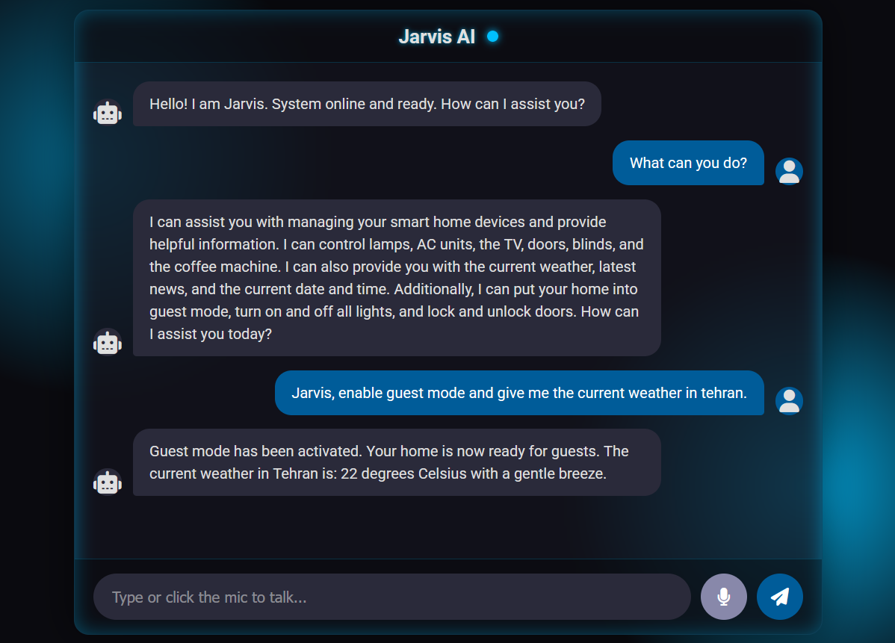
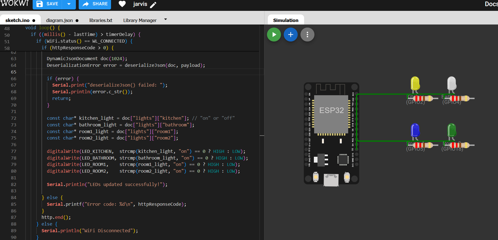

# jarvis-AI-Assistant
# Jarvis Smart Home Assistant

<p align="center">
  
  
  
  
</p>

This project is an intelligent smart home assistant inspired by **J.A.R.V.I.S.**, Tony Stark's (Iron Man's) iconic AI. The primary goal is to control home devices using natural language commands—in both **English and Persian**—through a simple web interface with voice support.

<br>

### Project Overview

|                   Chat UI                    |                 Hardware Simulator (Wokwi)                 |
|:--------------------------------------------:|:----------------------------------------------------------:|
|        |                    |
| *Sending text and voice commands to Jarvis.* | *Controlling LEDs on an ESP32, representing home devices.* |

---

## 🚀 Key Features

- **Comprehensive Device Control**: Manage lights, air conditioning (AC) units, a TV, blinds, door locks, and even a coffee machine.
- **Intelligent Agent**: Utilizes a **LangChain** agent with **Function Calling** to accurately understand user intent and execute the corresponding actions.
- **Bilingual Natural Language Support**: Understands and responds to commands in both English and Persian.
- **Real-time Information**: Fetches live data such as weather forecasts, the latest news, and the current date/time by connecting to external APIs.
- **Simple & Functional UI**: A minimalist user interface built with HTML, CSS, and JavaScript for easy interaction.
- **Voice Command Support**: Features Speech-to-Text (STT) capabilities using the **Whisper** model via the Groq API, allowing for hands-free control.
- **Hardware Simulation**: Integrates with the **Wokwi** simulator to test ESP32-based hardware control without needing physical components.

---

## 🛠️ Tools & Technology Stack

| Category      | Tool / Technology                                                                                                                              | Description                                                                 |
|---------------|------------------------------------------------------------------------------------------------------------------------------------------------|-----------------------------------------------------------------------------|
| **Backend**   | **Python**, **Flask**                                                                                                                          | For building the web server and core application logic.                     |
| **LLM**       | **LLaMA 3 (via Groq)**                                                                                                                         | The core model for NLU and decision-making (`llama3-70b-8192`, `llama-3.3-70b-versatile`). |
| **Agent**     | **LangChain**                                                                                                                                  | For creating the intelligent agent and managing the tool-calling chain.     |
| **Frontend**  | **HTML**, **CSS**, **JavaScript**                                                                                                              | For designing the simple, interactive client-side UI.                       |
| **Voice Stack** | **Groq API (Whisper)**                                                                                                                       | For high-speed and accurate Speech-to-Text transcription.                   |
| **Data APIs** | **OpenWeatherMap API**, **NewsAPI**                                                                                                            | For fetching live weather and news data.                                    |
| **Hardware**  | **ESP32**, **Wokwi Simulator**                                                                                                                 | For simulating the control of physical devices like LEDs (lights).          |

---

## 🔌 Hardware Simulation with Wokwi & ESP32

To demonstrate the project's interaction with hardware components, the online **Wokwi** simulator is used.

- **ESP32 Code**: The necessary microcontroller code is located in the `esp32_wokwi` directory.
- **How it Works**:
  1. A user issues a command like, "Turn on the kitchen light."
  2. The agent processes the request and updates the device's state on the Python server (`app.py`).
  3. The ESP32 code running in the Wokwi simulator periodically sends a GET request to the `/get_device_states` endpoint on the server.
  4. The server responds with a JSON object containing the current state of all devices.
  5. The ESP32 parses this JSON and turns on the corresponding LED for the kitchen light.

---

## ⚙️ Getting Started

Follow these steps to run the project locally.

**1. Clone the Repository:**
```bash
git clone https://github.com/mohammadkahr/jarvis-AI-Assistant.git 
cd jarvis-AI-Assistant
```

**2. Create and Activate a Virtual Environment:**
```bash
# For macOS/Linux
python3 -m venv venv
source venv/bin/activate

# For Windows
python -m venv venv
.\venv\Scripts\activate
```

**3. Install Dependencies:**
```bash
pip install -r requirements.txt
```

**4. Set Up API Keys:**
Create a file named `.env` in the project root and add your API keys, following the example below:
```env
GROQ_API_KEY="YOUR_GROQ_API_KEY"
NEWS_API_KEY="YOUR_NEWS_API_KEY"
OPENWEATHER_API_KEY="YOUR_OPENWEATHERMAP_API_KEY"
```

**5. Run the Application:**
```bash
python app.py
```

**6. Access the UI:**
Open your web browser and navigate to `http://127.0.0.1:5001`.

---

## ⚠️ Important Notes

- **🔑 API Keys**: To enable the news, weather, and LLM-powered tools, you must obtain valid API keys from their respective websites (`NewsAPI`, `OpenWeatherMap`, `Groq`) and place them in the `.env` file.

- **🌐 Wokwi Simulator**: No physical hardware is required for testing.

---

## 👤 Connect with Me

To see my other projects or get in touch, feel free to check out my GitHub profile:

[](https://github.com/mohammadkahr)

<p align="left">
  <a href="mailto:harandi.mohamma@gmail.com">
    
  </a>
</p>